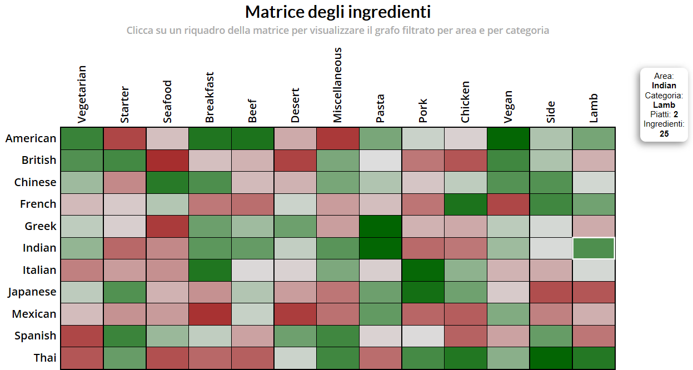
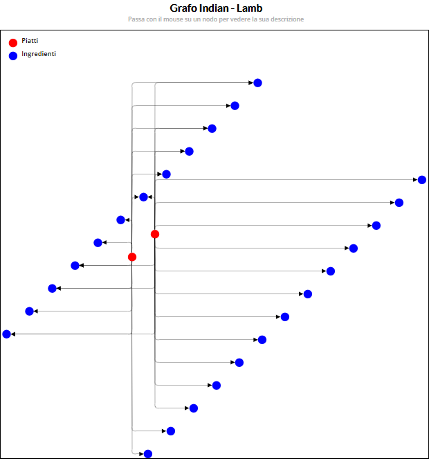

# Progetto InfoVis A.A. 2018-2019 - L-Drawing per Grafo degli Ingredienti
Progetto Finale per il corso di Visualizzazione delle Informazioni, Università Roma Tre, a.a. 2018-2019.

## Specifica del progetto e riferimenti

  
Creazione di un sistema di visualizzazione per il Grafo degli Ingredienti che sfrutti la tecnica denominata L-Drawing, un nuovo paradigma per la rappresentazione di grafici diretti che mira a combinare le caratteristiche di leggibilità dei disegni ortogonali con il potere espressivo delle rappresentazioni di matrici. 
  
<i>
The data set describes 151 food recipes extracted from the TheMealDB database. TheMealDB was built in 2016 to provide a free data source API for recipes online. TheMealDB originated on the Kodi forums as a way to browse recipes on a TV.

The provided data set contains three files. File “ingredients" lists 297 food ingredients, e.g. "Beef","Flour","Red Wine","Onion","Carrot","Thyme",”Mustard". File “areas” contains 11 areas (countries) that are popular for their dishes around the globe: "American”, "British”, "Chinese","French","Greek","Indian","Italian","Japanese","Mexican","Spanish",”Thai”.

[1] TheMealDB database: https://www.themealdb.com/

[2] http://mozart.diei.unipg.it/gdcontest/contest2019/topics.html

[3] L-Drawing: https://arxiv.org/pdf/1509.00684v1.pdf

</i>

## Funzionalità Progettuali

- 
 Separazione della visualizzazione in 2 pagine HTML distinte: nella prima si visualizza la <i><b>Matrice degli Ingredienti</b></i>, una struttura dati che raccoglie piatti ed ingredienti in base ad una certa <i>Area Geografica</i> ed una <i>Categoria Culinaria</i>. Cliccando su un riquadro che presenti almeno un piatto al suo interno, viene generata una seconda pagina HTML nel quale viene visualizzato il <i><b>Grafo degli Ingredienti</b></i> filtrato per Area e Categoria e disegnato tramite tecnica L-Drawing.

- 
 Passando con il mouse sui vari riquadri della Matrice degli Ingredienti è possibile visionare alcuni dettagli: nome dell'area, nome della categoria, numero di piatti e numero di ingredienti. Il riquadro viene evidenziato tramite l'apposizione di un contorno bianco.

- 
 Passando con il mouse sui vari nodi del Grafo degli Ingredienti è possibile visionare il nome del piatto o dell'ingrediente selezionato. Il nodo viene evidenziato mediante un leggero effetto di rimpicciolimento.

## Caricamento dati da file esterno

 Qualora si volessero caricare i dati da file esterno, potremmo riscontrare dei problemi di sicurezza relativi alle politiche usate dal particolare Web Browser scelto. Per questo motivo, bisogna usare un server http.
<ul>
<li> 
Su un terminale Windows, dal prompt dei comandi bisogna spostarsi nella cartella in cui si trova il file index.html e, avendo Python installato, bisogna digitare il comando: <i><b>'python -m http.server [porta]'</b></i>. </li> 

<li> 
Su un terminale Linux, dal prompt dei comandi bisogna spostarsi nella cartella in cui si trova il file index.html e, avendo Python installato, bisogna digitare il comando: <i><b>'python -m SimpleHTTPServer [porta]'</b></i> o l'equivalente per Python3 <i><b>'python3 -m http.server [porta]'</b></i>. </li>

  </ul>

## Versione utilizzata
La versione di [d3.js](https://github.com/d3/d3) utilizzata per questo mini progetto è la [v5](https://github.com/d3/d3/blob/master/CHANGES.md), ad oggi la più recente.

## Anteprime grafiche

<b>Matrice Degli Ingredienti</b>

<b>Grafo Ingredienti Area-Categoria</b>
  

  
 

